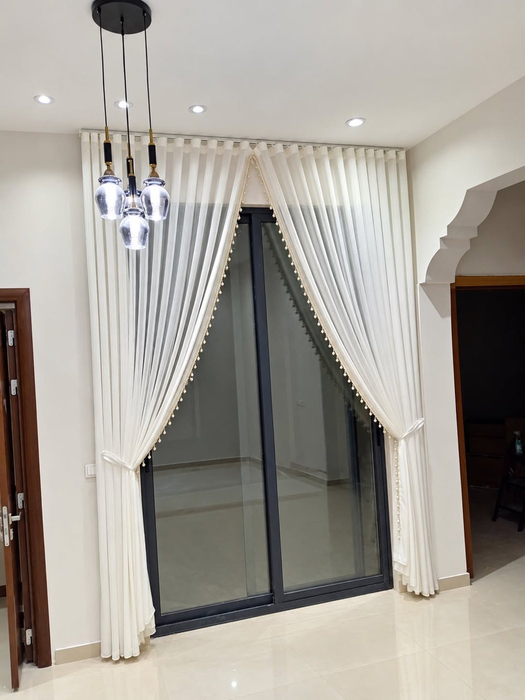
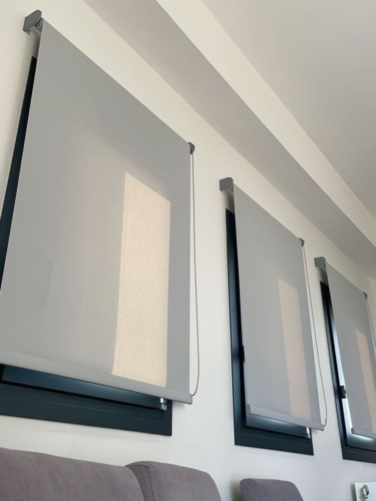
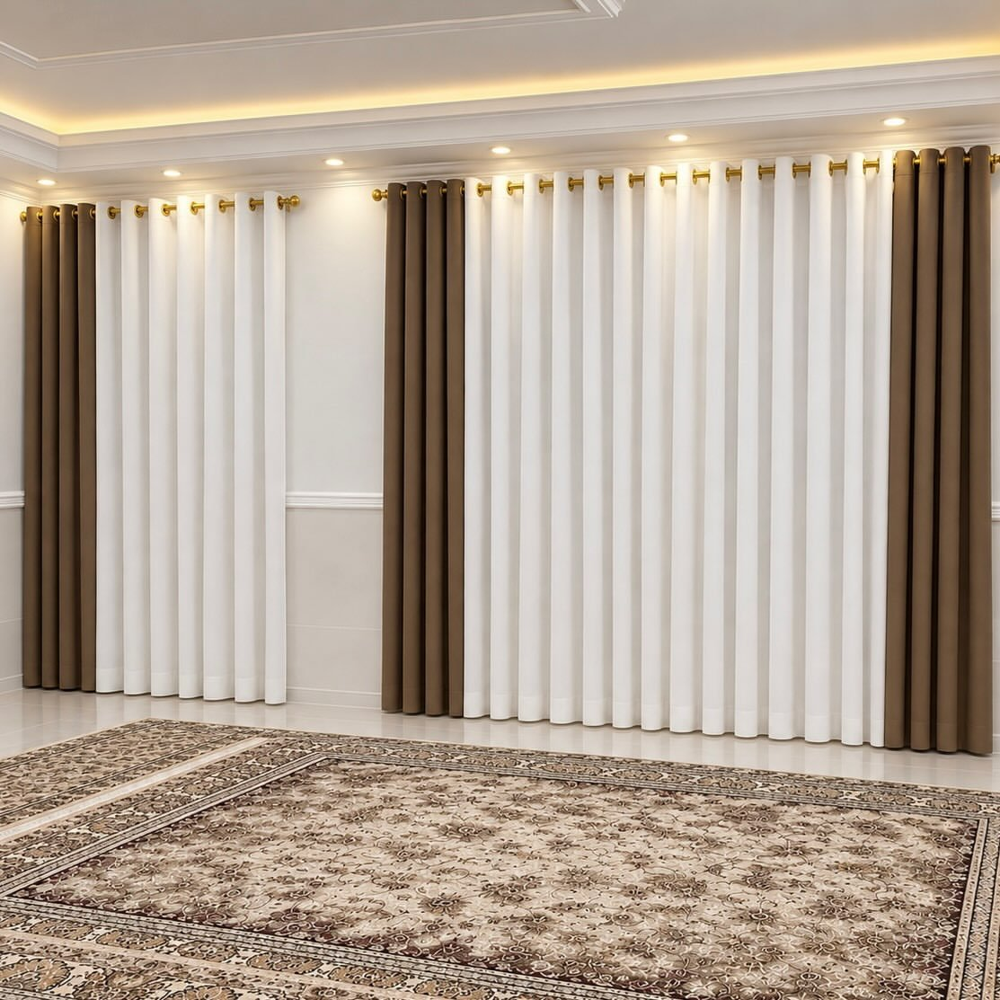

نبدأ بزيارة لأخذ مقاسات النوافذ وعرض العينات، ثم نفصّل الستائر في ورشتنا في الضجيج ونركّبها ونضبط حركتها.

## ماذا نفصّل في الفروانية؟

نفصّل في محافظة الفروانية كل أنواع الستائر التي نقدمها في باقي الكويت: [الويفي](/curtains/wave/) مع [الشيفون](/curtains/sheer/) للصالات والمجالس، و[الرول](/curtains/roll/) و[الزيبرا (ليلي نهاري)](/curtains/zebra/) للغرف والمطابخ والمكاتب، و[البلاك أوت](/curtains/blackout/) لغرف النوم، و[الخشبي](/curtains/wooden/)، و[ستائر الأطفال](/curtains/kids/) بطباعة مخصصة.

## نماذج من أعمالنا

الصور التالية من أعمال نفّذناها في مناطق مختلفة من الكويت، ونفّذ مثلها في الفروانية:

- **شيفون أبيض بأطراف كرات لباب منزلق عالٍ: يُربط على الجانبين ليكشف الباب نهاراً.**

- **رول رمادي لثلاث نوافذ منفصلة: لكل نافذة ستارتها على مقاسها، بسلسلة تحكم جانبية.**

- **نموذج تصميم: ستائر حلقات بيضاء بأطراف بنية على أعمدة ذهبية لمجلس.**

## كيف تطلب؟

أرسل صورة النافذة ومقاسها التقريبي عبر واتساب لعرض سعر مبدئي، ثم نحدد موعد الزيارة. الأسعار كلها في [صفحة الأسعار](/prices/)، وتفاصيل الضمان في [الضمان والاسترجاع](/warranty/).
