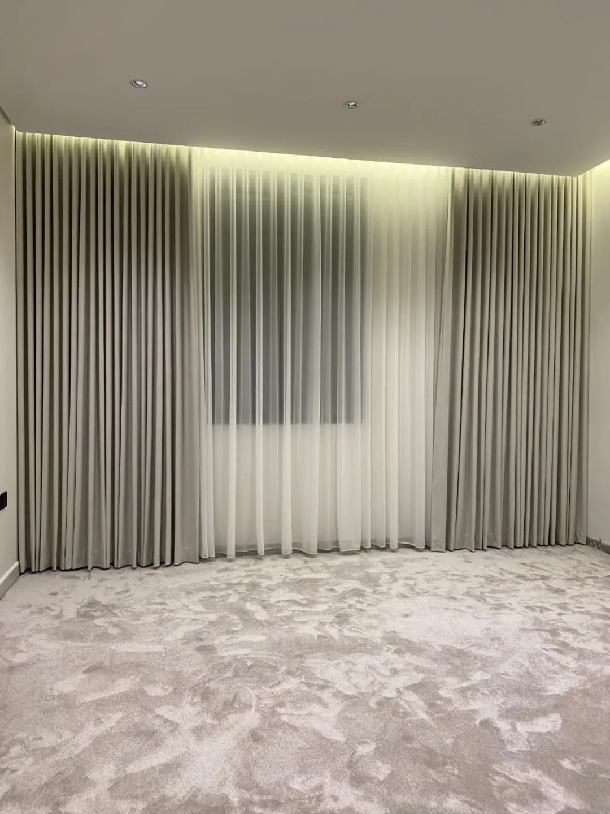

أفضل ستارة لغرفة النوم هي التي تجمع **العتمة ليلاً** و**الخصوصية نهاراً**. وأكثر الحلول عملية: ستارة بلاك أوت لحجب الضوء، ومعها طبقة شيفون تسمح بضوء النهار دون أن يرى أحد الداخل. وإن كانت النافذة صغيرة أو أردت مظهراً بسيطاً، فرول بلاك أوت وحده يكفي.

## ما الذي تحتاجه غرفة النوم تحديداً؟

- **عتمة للنوم:** خاصة لمن ينام نهاراً أو تواجه نافذته إنارة الشارع.
- **خصوصية:** إذا كانت النافذة تطل على جار أو شارع.
- **تحكم بالضوء:** أن تختار بين ضوء خفيف وعتمة كاملة دون تبديل الستارة.

## أي الخيارات أنسب؟

| الخيار | العتمة | الخصوصية نهاراً | السعر |
|---|---|---|---|
| [رول بلاك أوت](/curtains/blackout/) | عالية | عند إنزاله فقط | 6 د.ك/م² |
| ويفي مع بلاك أوت (طبقة واحدة) | عالية | عند إغلاقه فقط | 6 د.ك/م² |
| خام بلاك أوت مع شيفون | عالية | نعم، بالشيفون | 9 د.ك/م² |
| [شيفون](/curtains/sheer/) وحده | منخفضة | جزئية | 5 د.ك/م² |

السعر يشمل القماش والسكة والتفصيل، والتركيب مجاني عند طلب 5 ستائر فأكثر.

## كيف تمنع تسرب الضوء من الأطراف؟

حتى القماش البلاك أوت يسمح بمرور الضوء من حوله إذا كانت الستارة بمقاس النافذة تماماً. لذلك:

- اجعل الستارة القماشية أعرض من النافذة، وأعلى منها إن أمكن.
- مع السقف الجبس، ركّب السكة داخل الكورنيش ليُغلق الفراغ العلوي.
- في الرول، يُقاس العرض بحسب التركيب داخل فتحة النافذة أو فوقها، وهذا ما نحدده في زيارة القياس.

## مثال من أعمالنا

في [ستائر ويفي رمادية مع شيفون لغرفة نوم](/projects/wave-grey-sheer-bedroom/)، ركّبنا ستائر ويفي رمادية على جانبي الجدار وطبقة شيفون بيضاء أمام النافذة: الشيفون للنهار، والطبقة القماشية تُسحب عند الحاجة للعتمة والستر.

## ماذا عن غرف الأطفال؟

لغرف الأطفال قماش مطبوع بتصاميم مناسبة لهم بسعر 6 د.ك للمتر المربع. راجع [ستائر الأطفال](/curtains/kids/).

## أسئلة شائعة

**هل البلاك أوت يحجب الضوء بالكامل؟** القماش يحجب الضوء المار من خلاله، أما الضوء من الأطراف فيعتمد على المقاس وطريقة التركيب.

**هل أختار رولاً أم ويفي لغرفة النوم؟** الرول مرتب ويأخذ مساحة أقل، والويفي يعطي طيات قماشية. اقرأ [الفرق بين ستائر الرول والستائر القماشية](/blog/roll-vs-fabric-curtains/).

**كم تكلفة ستارة غرفة نوم؟** نافذة 2 × 2.5 م (5 م²) برول بلاك أوت: 30 د.ك، ومع التركيب لأقل من 5 ستائر: 35 د.ك.
