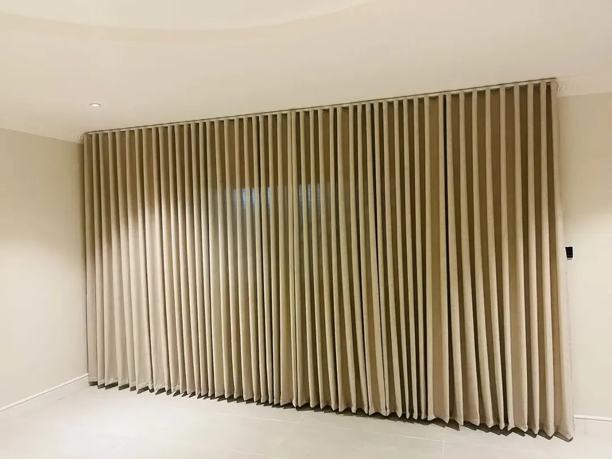

للديوانية والمجلس، الخيار الأكثر عملية هو **ستارة ويفي على سكة بطول الجدار**، ومعها طبقة شيفون إن كانت النوافذ تطل على الشارع. فهي تغطي الجدران الطويلة بطيات متساوية، وتُفتح وتُغلق بسهولة مع كثرة الاستعمال، ويمكن إخفاء سكتها في السقف الجبس.

## ما الذي يختلف في الديوانية والمجلس؟

- **جدران ونوافذ أطول** من بقية الغرف، فيظهر أي اختلاف في الطيات.
- **استعمال مسائي** في الغالب، مع حاجة للخصوصية من الشارع.
- **ضيوف وحركة**، فالستارة تُفتح وتُغلق كثيراً.

## أي نوع أختار؟

- **ويفي (6 د.ك/م²):** للجدار الكامل أو النوافذ الطويلة، بمظهر مرتب.
- **ويفي مع شيفون (الخام، 7 د.ك/م²):** الشيفون للنهار والخصوصية، والطبقة القماشية للمساء.
- **خام بلاك أوت مع شيفون (9 د.ك/م²):** إن كانت الشمس تدخل بقوة وقت العصر.

تفاصيل الأنواع في [ستائر الويفي](/curtains/wave/) و[معرض الويفي](/wave-curtains/).

## كيف أختار اللون والقماش؟

اختر لوناً ينسجم مع الجلسات والسجاد بدل أن ينافسها، فالستارة في الديوانية مساحة كبيرة من الجدار. وللنوافذ المشمسة، الأقمشة الصناعية مثل البوليستر أكثر مقاومة لبهتان اللون من القطن والكتان. اقرأ [أفضل قماش ستائر لجو الكويت](/blog/best-curtain-fabric-kuwait-climate/).

## مثال من أعمالنا

[ستارة ويفي بيج على جدار كامل](/projects/wave-beige-full-wall/) من السقف إلى الأرض، وهي فكرة مناسبة لجدار المجلس. ومن أعمالنا في حولي: [ويفي رمادي مع شيفون لديوانية](/projects/hawalli-wave-grey-sheer-diwaniya/) يغطي جدارين، و[ويفي مع شيفون لمجلس بجلسة أرضية](/projects/hawalli-wave-grey-sheer-majlis/)، و[ستائر بشراشيب على سكة منحنية لمجلس دائري](/projects/hawalli-majlis-curved-sheer-tassels/).

## مثال محسوب

جدار بعرض 4 م وارتفاع 3 م (12 م²) بويفي مع شيفون: 12 × 7 = 84 د.ك. والتركيب مجاني عند طلب 5 ستائر فأكثر، وأقل من ذلك 5 د.ك لكل ستارة. احسب مقاسك من [حاسبة الأسعار](/prices/).

## أسئلة شائعة

**هل يمكن تغطية الجدار كاملاً بستارة واحدة؟** نعم، الويفي على سكة بطول الجدار مناسب لذلك، ويُحدَّد عدد القطع حسب العرض.

**هل تأتون لأخذ المقاسات؟** نعم، الزيارة مجانية لأخذ المقاسات وعرض العينات (عدا العبدلي والصبية، فالمعاينة فيهما مدفوعة).

**كم يستغرق التنفيذ؟** من يومين إلى 3 أيام حسب الكمية.
