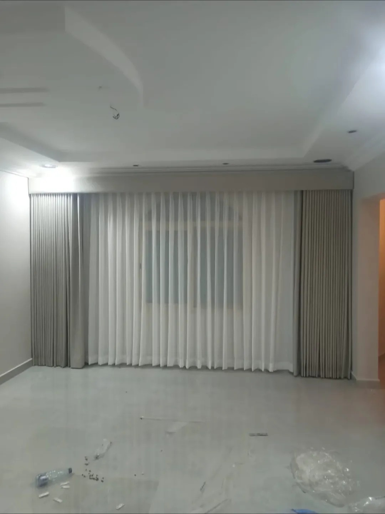

تحتاج سكة مزدوجة عندما تريد أمرين من النافذة نفسها: **ضوء النهار مع الخصوصية** بالشيفون، و**العتمة أو الستر الكامل** بالطبقة القماشية. فكل طبقة على سكة مستقلة، تفتح إحداهما وتترك الأخرى كما تريد.

## متى تكون السكة المزدوجة هي الخيار الصحيح؟

- **نافذة تطل على شارع أو جار:** الشيفون مغلق نهاراً للخصوصية، والقماش يُغلق ليلاً.
- **غرفة نوم:** شيفون للنهار، وبلاك أوت للنوم.
- **صالة أو مجلس:** مظهر أكمل بطبقتين، وتحكم أفضل بالضوء حسب الوقت.
- **نافذة مشمسة:** طبقتان تعترضان الشمس أكثر من طبقة واحدة.

## ومتى لا تحتاجها؟

إذا كانت النافذة في مطبخ أو حمام، أو لا تحتاج خصوصية نهاراً، أو كان الفراغ فوق النافذة ضيقاً. عندها يكفي [رول](/curtains/roll/) أو ويفي مع بلاك أوت بطبقة واحدة.

## كيف تُرتَّب الطبقتان؟

المعتاد أن يكون **الشيفون في الخلف** قرب الزجاج، و**القماش في الأمام**. فيبقى الشيفون مغلقاً نهاراً، وتُسحب الطبقة الأمامية فوقه عند الحاجة. ومع السقف الجبس، يجب أن يكون عمق الكورنيش كافياً لسكتين، وهذا مما نتحقق منه في زيارة القياس.

## كم السعر؟

| الخيار | الطبقات | السعر |
|---|---|---|
| ويفي مع شيفون (الخام) | قماش + شيفون | 7 د.ك/م² |
| خام بلاك أوت مع شيفون | بلاك أوت + شيفون | 9 د.ك/م² |
| ويفي مع بلاك أوت (طبقة واحدة) | طبقة واحدة | 6 د.ك/م² |

السعر يشمل القماش والسكة والتفصيل. مثال: نافذة 2.5 × 2.6 م (6.5 م²) بخام بلاك أوت مع شيفون = 6.5 × 9 = 58.5 د.ك، ويضاف 5 د.ك للتركيب إن كانت أقل من 5 ستائر. التفاصيل في [صفحة الأسعار](/prices/).

من أعمالنا: [ستائر ويفي مع شيفون تحت كورنيش](/projects/wave-sheer-cornice-living/) و[ستائر ويفي مع شيفون لغرفة في النسيم](/projects/nasim-room-wave-sheer/).

## أسئلة شائعة

**هل يمكن إضافة شيفون لاحقاً؟** يعتمد على وجود مكان لسكة ثانية فوق النافذة أو في الكورنيش، وهذا يتحدد بالمعاينة.

**هل الشيفون وحده يكفي للخصوصية؟** نهاراً غالباً نعم، أما ليلاً مع إنارة الغرفة فقد يظهر ما في الداخل، لذلك تُضاف الطبقة القماشية.

**هل أستطيع جمع رول مع شيفون؟** نعم، يمكن الجمع بينهما على نفس النافذة، والحساب بحسب سعر كل نوع.
