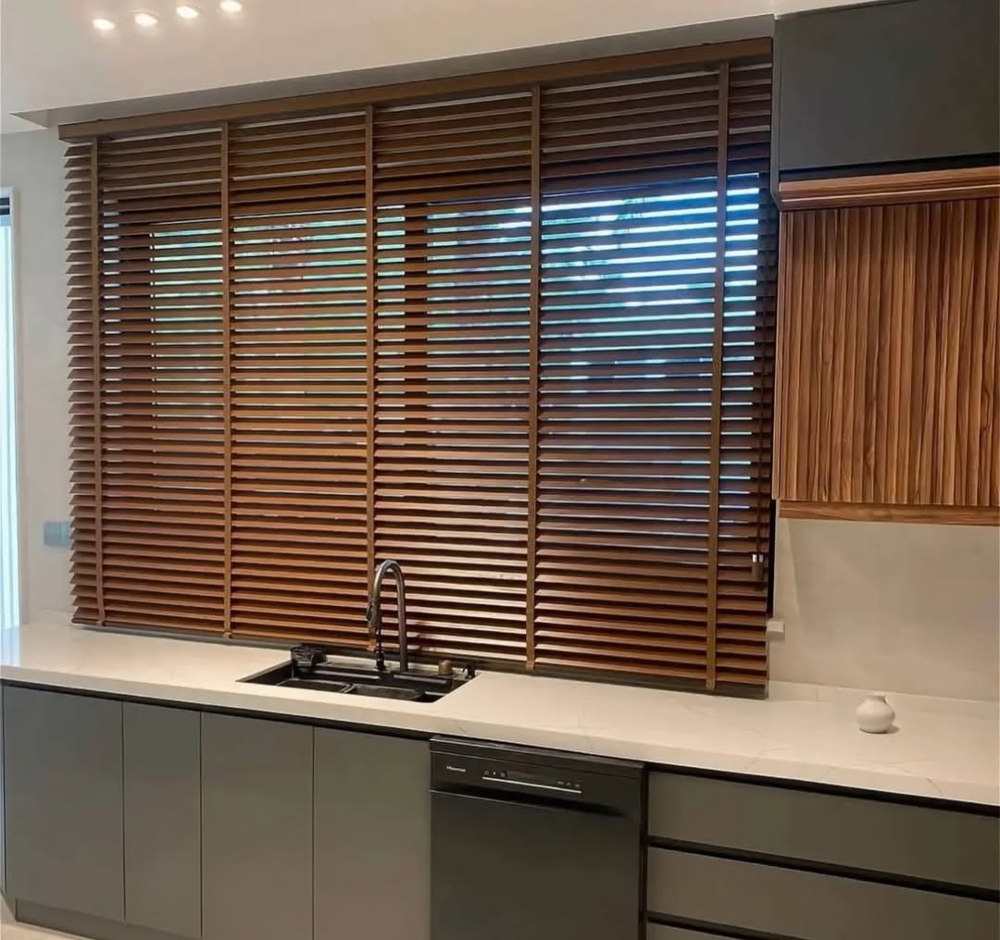
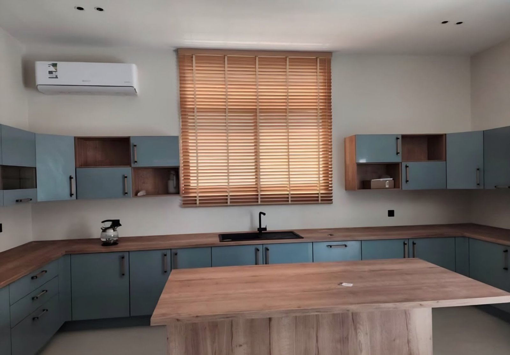

أنسب ستائر المطبخ هي التي **لا تجمع الرطوبة والدهون، وتبتعد عن النار، وتُمسح بسهولة**. ولذلك يناسب المطبخ غالباً الرول أو الخشبي أو الزيبرا، لا الستائر القماشية الطويلة بالطيات.

## أي نوع أختار للمطبخ؟

| النوع | لماذا يناسب المطبخ | السعر |
|---|---|---|
| [رول](/curtains/roll/) | مسطّح بلا طيات، يُمسح بقطعة رطبة، ويُرفع كاملاً فوق المغسلة | 6 د.ك/م² |
| [خشبي (بليندات)](/curtains/wooden/) | دفء الخشب، وشرائح تُمال للضوء والخصوصية | 13 د.ك/م² |
| [زيبرا (ليلي نهاري)](/curtains/zebra/) | ضوء وخصوصية دون رفع الستارة | 9 د.ك/م² |

## نافذة فوق المغسلة

النافذة فوق المغسلة تتعرض لرذاذ الماء، فاجعل الستارة تنتهي فوق حافة المغسلة لا داخلها، واختر رولاً أو خشبياً لأنهما يُرفعان بالكامل. ومع الخشبي امسح الشرائح بقطعة جافة أو رطبة قليلاً، ولا تبللها، لأن الخشب يتأثر بالرطوبة.

## قرب الموقد

ابعد أي ستارة عن الموقد. وإن كانت النافذة قريبة منه، فالرول المرفوع أثناء الطبخ أسلم من أي قماش متدلٍّ.

## من أعمالنا في المطابخ

- [ستائر خشبية بنية لنافذة مطبخ في العاصمة](/projects/capital-wooden-brown-kitchen/) بلون يطابق الخزائن العلوية.
- [ستارة خشبية بلون الخشب الطبيعي لمطبخ في حولي](/projects/hawalli-wooden-natural-kitchen/) تطابق الأسطح والجزيرة.

## كم تكلفة ستارة المطبخ؟

نافذة مطبخ 1.5 × 1.2 م (1.8 م²): برول 10.8 د.ك، وبخشبي 23.4 د.ك. والتركيب مجاني عند طلب 5 ستائر فأكثر، وأقل من ذلك 5 د.ك لكل ستارة. والزيارة لأخذ المقاسات مجانية (عدا العبدلي والصبية).

## أسئلة شائعة

**هل أستطيع وضع ستارة قماش في المطبخ؟** يمكن إن كانت النافذة بعيدة عن الموقد والمغسلة، لكن الرول والخشبي أسهل تنظيفاً وأسلم.

**أيهما أفضل للمطبخ: الرول أم الخشبي؟** الرول أرخص وأسهل في المسح، والخشبي أدفأ في المظهر. وكلاهما يُرفع بالكامل فوق المغسلة.

**كيف أنظف ستارة المطبخ؟** امسح الرول بقطعة رطبة ومنظف خفيف، والخشبي بقطعة جافة أو رطبة قليلاً. اقرأ [تنظيف الستائر دون إتلاف القماش](/blog/curtain-cleaning-care/).
