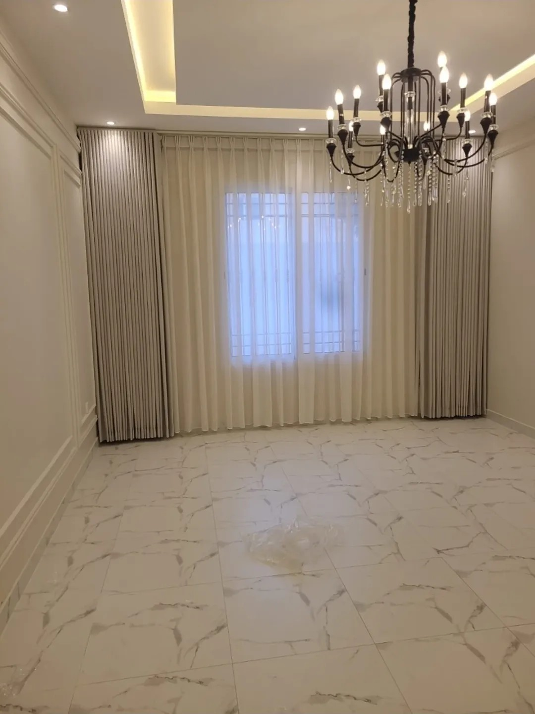
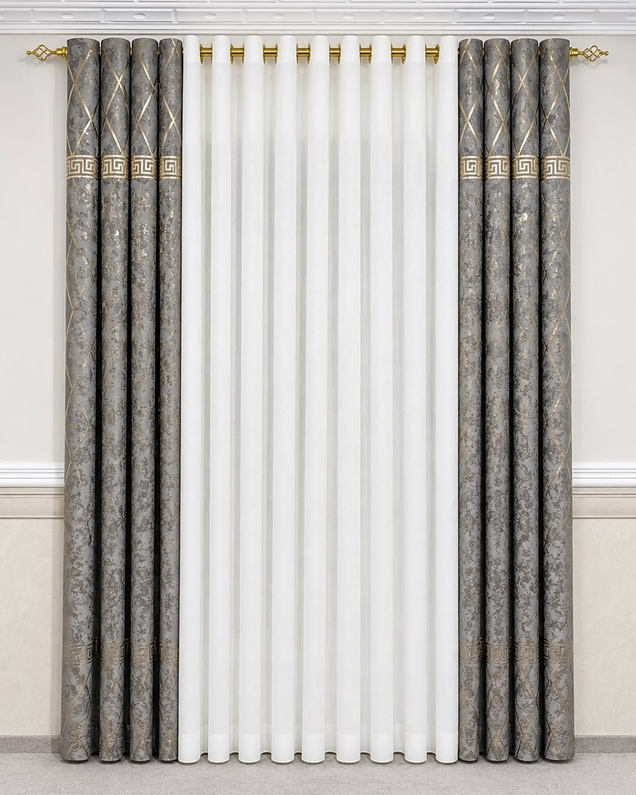

الويفي أنسب لمعظم صالات الكويت، خاصة مع السقف الجبس والنوافذ العريضة، لأنه يُركَّب على سكة يمكن إخفاؤها في الكورنيش ويعطي طيات متساوية على طول الجدار. أما الحلقات فتُعلَّق على عمود ظاهر فوق النافذة، وتناسب من يريد هذا المظهر ولديه مكان لتثبيت العمود. ونحن نفصّل النوعين.

## ما الفرق في طريقة التعليق؟

- **الويفي:** القماش يُعلَّق بخطافات على سكة خاصة، والسكة تحدد المسافة بين الطيات فتبقى متساوية دائماً.
- **الحلقات:** ثقوب معدنية في أعلى القماش تمر عبر عمود. ولا تعمل على السكة، فهي تحتاج عموداً ظاهراً.

لذلك إذا كانت الصالة بسقف جبس وكورنيش مخفي للستارة، فالويفي هو الخيار العملي.

## ما الفرق في الشكل؟

الويفي يعطي موجات ناعمة متماثلة من الأعلى إلى الأسفل، ويبدو مرتباً سواء كانت الستارة مفتوحة أو مغلقة. والحلقات تعطي طيات أكبر وأقل انتظاماً، ويظهر فيها العمود والحلقات كجزء من الشكل.

## أيهما يأخذ مساحة أقل عند الفتح؟

كلاهما يتجمع بشكل مرتب على جانب النافذة، والويفي عادة أقل قليلاً في المساحة التي يشغلها عند الفتح، فيترك الزجاج مكشوفاً أكثر. وهذا مهم في الواجهات الزجاجية والأبواب المنزلقة.

## مقارنة سريعة

| | ويفي | حلقات |
|---|---|---|
| التعليق | سكة (يمكن إخفاؤها في الجبس) | عمود ظاهر |
| الطيات | متساوية وثابتة | أكبر وأقل انتظاماً |
| الأنسب | الصالات والواجهات العريضة | النوافذ التي تقبل عموداً ظاهراً |
| السعر عندنا | 6 د.ك/م² | 6 د.ك/م² |

## هل تفصّلون النوعين؟

الويفي 6 د.ك للمتر المربع، ومع الشيفون (الخام) 7 د.ك، شاملاً القماش والسكة والتفصيل. شاهد [ستائر الويفي](/curtains/wave/) وأمثلة من أعمالنا مثل [ستائر ويفي مع شيفون تحت كورنيش](/projects/wave-sheer-cornice-living/) و[ستائر ويفي مع شيفون لصالة بثريا](/projects/wave-sheer-chandelier-living/). ونفصّل أيضاً ستائر الحلقات حسب مقاس نافذتك بسعر 6 د.ك للمتر المربع، أي بنفس سعر الويفي، فالاختيار بينهما على الشكل وطريقة التعليق لا على السعر.

## من أعمالنا بستائر الحلقات

ستائر الحلقات تبرز مع العمود الذهبي والأقمشة المنقوشة، وتناسب المجالس والصالات الكلاسيكية. ومن أعمالنا: [حلقات رمادية بنقشة ذهبية في الأحمدي](/projects/ahmadi-eyelet-grey-gold/)، و[حلقات بنية وبيضاء لمجلس في الفروانية](/projects/farwaniya-eyelet-brown-white-majlis/).

## أسئلة شائعة

**هل تفصّلون ستائر بحلقات؟** نعم، نفصّلها حسب المقاس بسعر 6 د.ك للمتر المربع، وهو نفس سعر الويفي. والتركيب مجاني عند طلب 5 ستائر فأكثر، وأقل من ذلك 5 د.ك لكل ستارة.

**هل يمكن إضافة شيفون مع الويفي؟** نعم، الويفي مع الشيفون (الخام) بسعر 7 د.ك للمتر المربع.

**هل الويفي مناسب للنوافذ الصغيرة؟** يمكن، لكن الرول أو الروماني قد يكون أنسب للنوافذ الصغيرة. راجع [الفرق بين ستائر الرول والستائر القماشية](/blog/roll-vs-fabric-curtains/).
