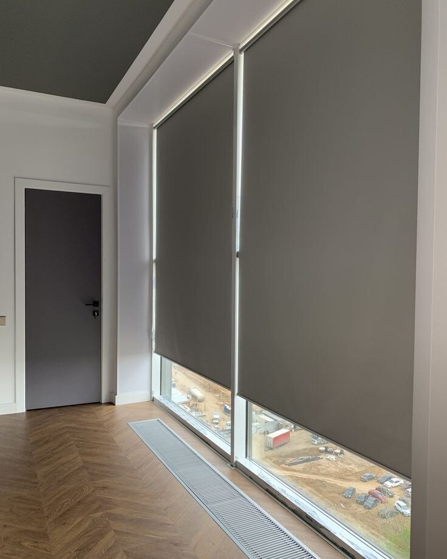

البلاك أوت (Blackout) ميزة في القماش لا نوع مستقل: قماش معتم يحجب الضوء بشكل شبه كامل، فتحصل على غرفة مظلمة حتى في وضح النهار. نفصّله على مقاس نافذتك بنظام **الرول** أو **الويفي**، ونركّبه في جميع مناطق الكويت، ويبدأ من **6 د.ك للمتر المربع** شاملة القماش والسكة والتفصيل، والتركيب مجاني عند طلب 5 ستائر فأكثر، وأقل من ذلك يُضاف 5 د.ك لتركيب كل ستارة.

زيارة أخذ المقاسات وعرض العينات مجانية، والتنفيذ من يومين إلى 3 أيام حسب الكمية. أرسل لنا صورة نافذتك ومقاسها التقريبي عبر واتساب لنعطيك عرض سعر لستائر البلاك أوت.

## لمن تناسب وأين تُركَّب؟

- **غرف النوم:** لمن يريد نوماً عميقاً دون ضوء الصباح، ولمن ينام نهاراً بسبب العمل بنظام الورديات.
- **غرف مشاهدة الأفلام والألعاب:** حيث يزعج ضوء النهار الشاشة.
- **النوافذ المطلة على شارع مزدحم:** لتخفيف إنارة الشارع والسيارات ليلاً.

## نموذج من ستائر الرول الغامقة

الصورة نموذج لستارة رول غامقة، وتُعرض عليك العينات والألوان المناسبة أثناء الزيارة.

## المزايا والعيوب

- **المزايا:** حجب شبه كامل للضوء، وخصوصية أعلى داخل الغرفة، وتتوفر بنظام الرول المرتب أو الويفي بطياته الناعمة.
- **العيوب:** لا يدخل ضوء النهار فتحتاج إلى إضاءة داخلية عند إغلاقها، وقد يظهر خيط ضوء رفيع عند الأطراف حسب المقاس وموضع التركيب، ومظهرها أقل نعومة من الشيفون.

## الأنظمة المتاحة

- **رول بلاك أوت:** قماش مسطّح يُلَفّ على أنبوب أعلى النافذة، ولا يأخذ مساحة. التفاصيل في [ستائر الرول](/curtains/roll/)، وللمقاسات القياسية انظر [الرول الجاهز](/ready-roll-curtains/).
- **ويفي بلاك أوت (طبقة واحدة):** طيات موجية ناعمة ومتساوية بنفس سعر الرول. التفاصيل في [ستائر الويفي](/curtains/wave/).

- **خام بلاك أوت مع شيفون:** قماش بلاك أوت أمامي مع طبقة شيفون على نفس السكة: ضوء ناعم نهاراً وعتمة عند الحاجة، بسعر **9 د.ك للمتر المربع**.

## كيف نقيس ونركّب؟

1. زيارة منزلية مجانية لأخذ المقاسات وعرض العينات.
2. تفصيل الستائر في ورشتنا في الضجيج خلال يومين إلى 3 أيام حسب الكمية.
3. تركيب في موقعك: مجاني عند 5 ستائر فأكثر، وأقل من ذلك 5 د.ك لكل ستارة.

## السعر

السعر بالمتر المربع (العرض × الارتفاع): **6 د.ك** للبلاك أوت بطبقة واحدة (رول أو ويفي)، و**9 د.ك** للخام بلاك أوت مع شيفون، والسعر شامل القماش والسكة والتفصيل. والتركيب مجاني عند طلب 5 ستائر فأكثر، وأقل من ذلك يُضاف 5 د.ك لتركيب كل ستارة. مثال توضيحي لطبقة واحدة: نافذة عرضها 2 م وارتفاعها 2.5 م مساحتها 5 م²، فتقدَّر بـ 30 د.ك، ويُضاف 5 د.ك للتركيب إن كانت ستارة واحدة. والمبلغ النهائي يُؤكَّد بعد القياس. قدّر مبلغ نافذتك من [حاسبة الأسعار](/prices/).

## أسئلة شائعة

### هل يحجب البلاك أوت الضوء بالكامل؟

يحجبه بشكل شبه كامل. وقد يظهر خيط ضوء رفيع عند الأطراف، ويتأثر ذلك بمقاس الستارة وموضع تركيبها.

### ما الفرق بين البلاك أوت والرول؟

البلاك أوت ميزة في القماش تحجب الضوء، والرول نظام تشغيل بلفّ الستارة على أنبوب. لذلك ينفَّذ البلاك أوت رولاً أو ويفي.

### هل يمكن جمعه مع الشيفون؟

نعم، ويُسمّى «خام بلاك أوت مع شيفون»، وسعره 9 د.ك للمتر المربع. تحصل على ضوء ناعم نهاراً وعتمة عند إغلاق طبقة البلاك أوت.

### هل التركيب مجاني؟

مجاني عند طلب 5 ستائر فأكثر، وأقل من ذلك يُضاف 5 د.ك لتركيب كل ستارة.

### كم يستغرق التنفيذ؟

من يومين إلى 3 أيام حسب الكمية.

تعرّف أيضاً على [ستائر الشيفون](/curtains/sheer/) و[خدمة تفصيل الستائر](/services/tailoring/) و[تركيب الستائر](/services/installation/).
