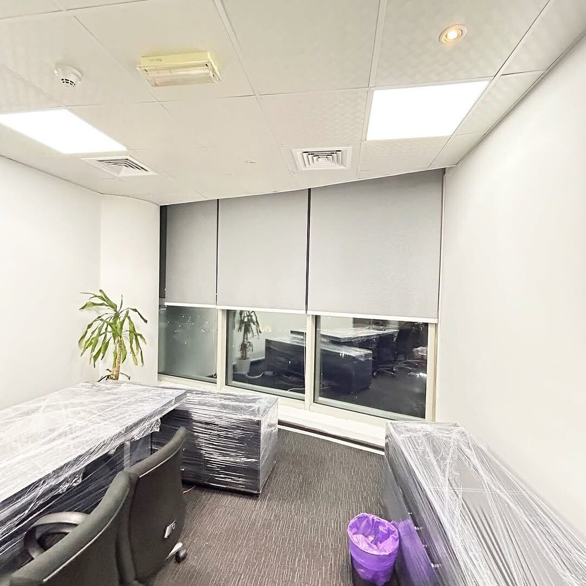

الستائر المكتبية عندنا ستائر **رول** تُفصَّل حسب مقاس نوافذ المكتب: تتحكم بها في الضوء ووهج الشاشات، وتعطي المكان مظهراً مرتباً يناسب بيئة العمل، وتُمسح بسهولة.

## لماذا الرول للمكاتب؟

- **تحكم بالوهج:** تُنزَل الستارة إلى المستوى الذي يمنع انعكاس الشمس على الشاشات، ويبقى باقي النافذة مفتوحاً.
- **مظهر مرتب:** سطح مستوٍ بلا طيات، يناسب الواجهات الزجاجية والأسقف المعلقة.
- **سهولة العناية:** يُمسح بقطعة قماش رطبة، ولا يجمع الغبار كالأقمشة ذات الطيات.

## تقسيم الواجهات العريضة

في الواجهات العريضة نقسّم النافذة إلى عدة ستائر متجاورة، كما في مشروعنا [ستائر رول مكتبية رمادية](/products/roller-office-grey/): ثلاث ستائر على نافذة واحدة، فيُرفع كل جزء وحده حسب الحاجة.

## أي نوع لأي مساحة في المكتب؟

| المساحة | النوع المقترح | السعر |
|---|---|---|
| المكاتب وصالات الموظفين | [رول](/curtains/roll/) | 6 د.ك/م² |
| غرف الاجتماعات والعرض | [رول بلاك أوت](/curtains/blackout/) لحجب الضوء عند العرض | 6 د.ك/م² |
| مكاتب الإدارة | [خشبي (بليندات)](/curtains/wooden/) لمظهر دافئ | 13 د.ك/م² |

## السعر والتنفيذ

تبدأ أسعار الستائر المكتبية من 6 د.ك للمتر المربع (سعر الرول)، والسعر شامل القماش والسكة والتفصيل. والتركيب مجاني عند طلب 5 ستائر فأكثر، وأقل من ذلك يُضاف 5 د.ك لتركيب كل ستارة. مثال: مكتب بنافذة 3 × 1.8 م (5.4 م²) مقسّمة إلى 3 ستائر رول: 5.4 × 6 = 32.4 د.ك، ويُضاف 15 د.ك للتركيب لأنها أقل من 5 ستائر.

أرسل لنا مقاس النافذة عبر واتساب لعرض سعر مبدئي، والزيارة وأخذ المقاسات **مجانية**، والتنفيذ من يومين إلى 3 أيام حسب الكمية. للأسعار كلها راجع [صفحة الأسعار](/prices/).
