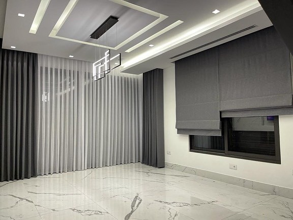
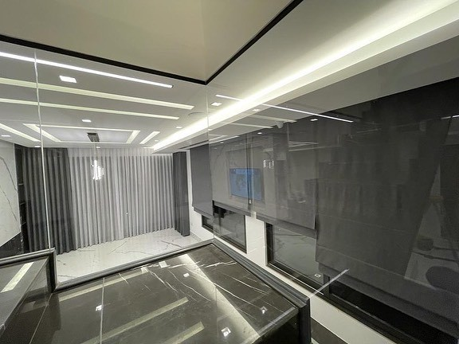

الستائر الرومانية قطعة قماش واحدة على مقاس النافذة، تُرفع فتنطوي على شكل طيات أفقية متراصة في أعلاها، وتنزل مسطّحة عند إغلاقها. تجمع بين مظهر القماش ودقّة الستارة التي لا تتجاوز حدود النافذة، لذلك تُستعمل كثيراً على النوافذ الجانبية وفوق المغاسل والمكاتب، أو بجانب ستائر قماش مع شيفون في الغرفة نفسها.

## من أعمالنا

في صالة بالنسيم (الجهراء) ركّبنا ستائر رومانية رمادية فوق النوافذ الجانبية، وعلى الجدار الرئيسي ستائر قماش بالدرجة نفسها مع طبقة شيفون بيضاء:

تفاصيل المشروع وصوره كاملة في [صالة النسيم: ستائر شيفون ورومانية](/projects/nasim-living-sheer-roman/).

## السعر والطلب

تبدأ الستائر الرومانية من **7 د.ك للمتر المربع**، وتُحسب بالمتر المربع مثل بقية أنواعنا. والتركيب مجاني عند طلب 5 ستائر فأكثر، وأقل من ذلك يُضاف 5 د.ك لتركيب كل ستارة. الزيارة المنزلية لأخذ المقاسات وعرض العينات **مجانية**؛ أرسل صورة النافذة ومقاسها التقريبي عبر واتساب لعرض سعر مبدئي.

قارن أيضاً مع [ستائر الرول](/curtains/roll/) و[ستائر البلاك أوت](/curtains/blackout/)، وراجع [جدول الأسعار](/prices/).
