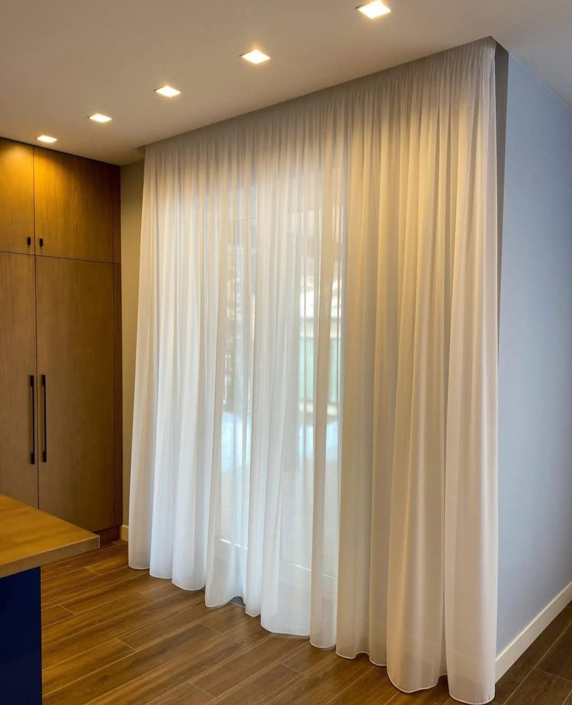
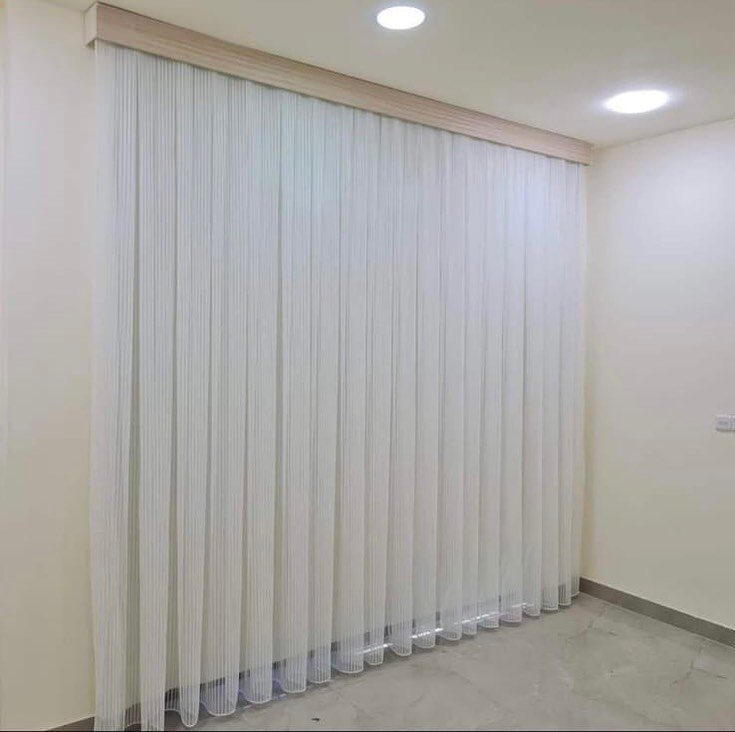
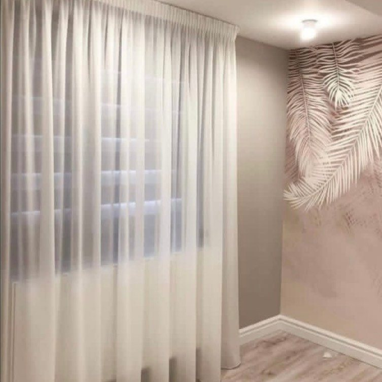
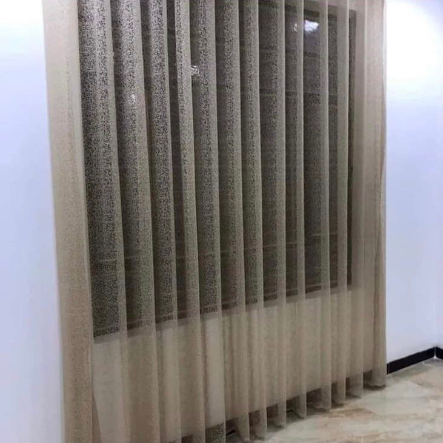
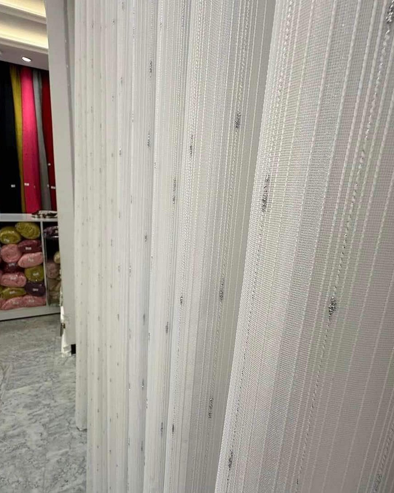

الشيفون ستارة خفيفة تمرّر الضوء الطبيعي بنعومة وتُبقي شيئاً من الخصوصية، وتناسب الصالات والمجالس وغرف النوم. نفصّلها حسب مقاس نافذتك، وتُستخدم وحدها أو طبقةً أمامية فوق ستارة أخرى.

نوفّرها بألوان فاتحة كالأبيض والبيج، **سادة** أو **بخطوط وتفاصيل لامعة**، وتُركَّب بطيات ناعمة على سكة مخفية أو خلف كورنيش.

## نماذج من ستائر الشيفون

## كيف تطلب؟

تبدأ أسعار ستائر الشيفون من 5 د.ك للمتر المربع، وعند دمجه مع الويفي (وهي «الخام») تبدأ من 7 د.ك. أرسل لنا صورة النافذة ومقاسها التقريبي عبر واتساب لعرض سعر مبدئي. الزيارة المنزلية وأخذ المقاسات وعرض العينات **مجانية**، وأسعارنا تُحسب بالمتر المربع والسعر شامل القماش والسكة والتفصيل. والتركيب مجاني عند طلب 5 ستائر فأكثر، وأقل من ذلك يُضاف 5 د.ك لتركيب كل ستارة.

شاهد أيضاً [ستائر ويفي مع شيفون](/wave-curtains/) و[ستائر الرول](/curtains/roll/).
