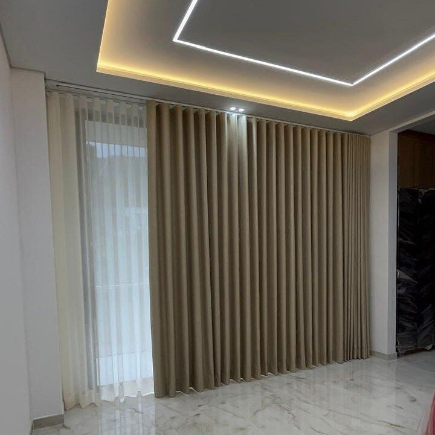

ستائر الويفي (Wave Curtains) ستائر قماش تُعلَّق على سكة خاصة فتنتج طيات موجية متساوية على طول الستارة بلا حلقات ظاهرة. نفصّلها على مقاس نافذتك ونركّبها في جميع مناطق الكويت، وتبدأ من **6 د.ك للمتر المربع** شاملة القماش والسكة والتفصيل، والتركيب مجاني عند طلب 5 ستائر فأكثر، وأقل من ذلك يُضاف 5 د.ك لتركيب كل ستارة.

زيارة أخذ المقاسات وعرض العينات مجانية، والتنفيذ من يومين إلى 3 أيام حسب الكمية. أرسل لنا صورة نافذتك ومقاسها التقريبي عبر واتساب لعرض سعر لستائر الويفي.

## لمن تناسب ستائر الويفي؟

لمن يريد مظهراً منتظماً للستارة في الصالات والمجالس وغرف النوم، وللنوافذ العريضة والطويلة. وإن كنت تفضّل ستارة مسطّحة تُلَفّ ولا تأخذ مساحة فانظر [ستائر الرول](/curtains/roll/).

## المزايا والعيوب

- **المزايا:** طيات موجية متساوية بلا حلقات ظاهرة، وتُنفَّذ بطبقة واحدة أو بطبقتين (قماش وشيفون)، وخامات وألوان متعددة، ويمكن تنفيذها بقماش بلاك أوت.
- **العيوب:** تحتاج سكة خاصة بالويفي، وتتجمع الستارة على جانبي النافذة عند فتحها فتحتاج مساحة جانبية، ولا تعطي مظهر الرول المسطّح.

## نموذج من ستائر الويفي

الصورة نموذج لستارة ويفي بيج أمامية مع شيفون أبيض. وتجد نماذج أكثر في [ستائر ويفي مع شيفون](/wave-curtains/).

## أمثلة من أعمالنا بالويفي

- [ويفي بيج مع شيفون يغطي جدار صالة كاملاً في العاصمة](/projects/capital-wave-beige-sheer-living/)
- [ويفي رمادي فاتح لنافذة درج بارتفاع طابقين في حولي](/projects/hawalli-wave-grey-staircase/)
- [ويفي بيج مع شيفون على سكتين لنافذة طويلة](/projects/hawalli-wave-beige-sheer-tall-window/)
- [ويفي بيج مع شيفون بلفة جانبية وشراشيب](/projects/wave-beige-sheer-swag-room/)
- [ويفي رمادي مع شيفون لغرفة نوم](/projects/wave-grey-sheer-bedroom/)

## الخيارات والأسعار

السعر بالمتر المربع (العرض × الارتفاع)، وهو شامل القماش والسكة والتفصيل:

- **ويفي بطبقة واحدة:** 6 د.ك.
- **ويفي مع شيفون («الخام»):** 7 د.ك، قماش أمامي مع شيفون: ضوء ناعم نهاراً وقماش يغطي النافذة عند الحاجة.
- **ويفي مع بلاك أوت (طبقة واحدة):** 6 د.ك، لحجب الضوء شبه الكامل. التفاصيل في [ستائر بلاك أوت](/curtains/blackout/).
- **خام بلاك أوت مع شيفون:** 9 د.ك.

مثال لنافذة واحدة مساحتها 5 م² (2 × 2.5 م): 30 د.ك للويفي بطبقة واحدة، و35 د.ك للخام، ويُضاف 5 د.ك للتركيب لأنها ستارة واحدة. والمبلغ النهائي يُؤكَّد بعد القياس. قدّر مبلغ نافذتك من [حاسبة الأسعار](/prices/).

## كيف نقيس ونركّب؟

1. زيارة منزلية مجانية لأخذ المقاسات وعرض العينات.
2. تفصيل الستائر في ورشتنا في الضجيج خلال يومين إلى 3 أيام حسب الكمية.
3. تركيب السكة والستارة في موقعك.

للتفاصيل راجع [تفصيل الستائر](/services/tailoring/) و[تركيب الستائر](/services/installation/).

## أسئلة شائعة

### ما الفرق بين الويفي والستائر العادية؟

تُعلَّق الستائر العادية بحلقات أو كباسين، أما الويفي فتُعلَّق على سكة خاصة تعطي طيات موجية منتظمة بلا حلقات ظاهرة.

### هل يمكن جمع الويفي مع الشيفون؟

نعم، ويُسمّى «الخام»، وسعره 7 د.ك للمتر المربع. وبقماش بلاك أوت مع الشيفون يصبح 9 د.ك.

### هل يوجد ويفي بلاك أوت؟

نعم، بطبقة واحدة بسعر 6 د.ك للمتر المربع، ومع الشيفون 9 د.ك.

### هل التركيب مجاني؟

مجاني عند طلب 5 ستائر فأكثر، وأقل من ذلك يُضاف 5 د.ك لتركيب كل ستارة.
