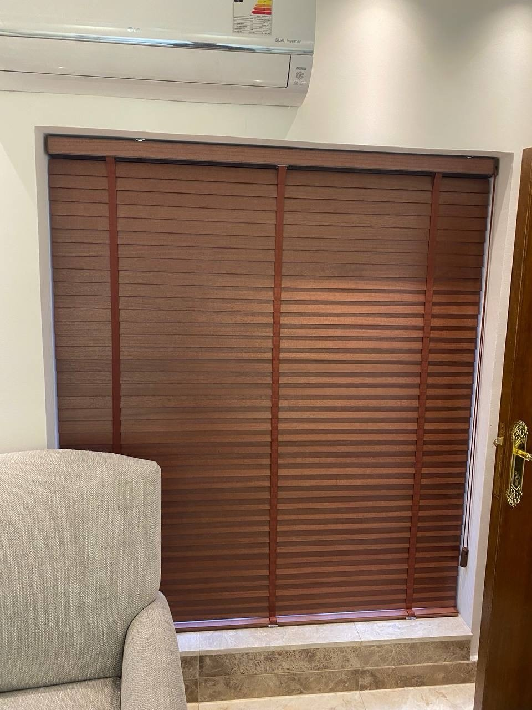
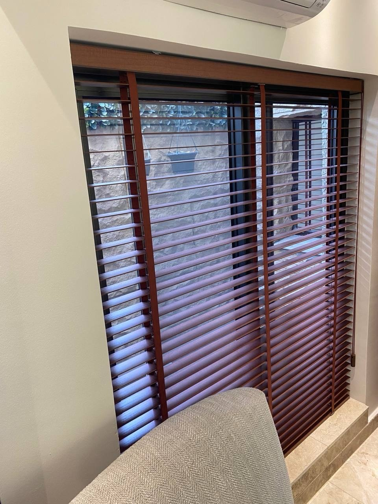

الستائر الخشبية (البليندات) شرائح خشبية أفقية مثبتة بأشرطة، تتحكم فيها بالضوء والخصوصية بتغيير زاوية الشرائح، وترفعها كاملة بحبل جانبي. وتعطي النافذة مظهراً دافئاً يناسب غرف الجلوس وغرف النوم والمطابخ.

## لمن تناسب؟

- لمن يريد التحكم بالضوء بدرجات بدل الفتح والإغلاق الكامل.
- للنوافذ التي تحتاج خصوصية مع دخول ضوء خفيف.
- للمساحات التي تناسبها لمسة خشبية، مثل غرف الجلوس والمطابخ.

## الشرائح المفتوحة والمغلقة

عند فتح الشرائح يدخل الضوء ويظهر ما خلف النافذة، وعند إمالتها تبقى الخصوصية مع ضوء خفيف، وعند إغلاقها تُحجب الرؤية. شاهد الفرق في مشروع [ستائر خشبية بنية لنافذتين في غرفة جلوس](/projects/wooden-brown-living/).

## التركيب داخل الفتحة أم فوقها؟

التركيب داخل فتحة النافذة يعطي مظهراً أنظف، والتركيب على الجدار فوقها يغطي النافذة كاملة ويقلل تسرب الضوء من الأطراف. ونحدد الطريقة المناسبة في زيارة أخذ المقاسات.

## السعر

تبدأ أسعار الستائر الخشبية من 13 د.ك للمتر المربع، والسعر شامل القماش والتفصيل. والتركيب مجاني عند طلب 5 ستائر فأكثر، وأقل من ذلك يُضاف 5 د.ك لتركيب كل ستارة. أرسل لنا صورة النافذة ومقاسها التقريبي عبر واتساب لعرض سعر مبدئي، والزيارة المنزلية وأخذ المقاسات **مجانية**.

ويستغرق التنفيذ من يومين إلى 3 أيام حسب الكمية. وللعناية بها اقرأ [تنظيف الستائر دون إتلاف القماش](/blog/curtain-cleaning-care/).
