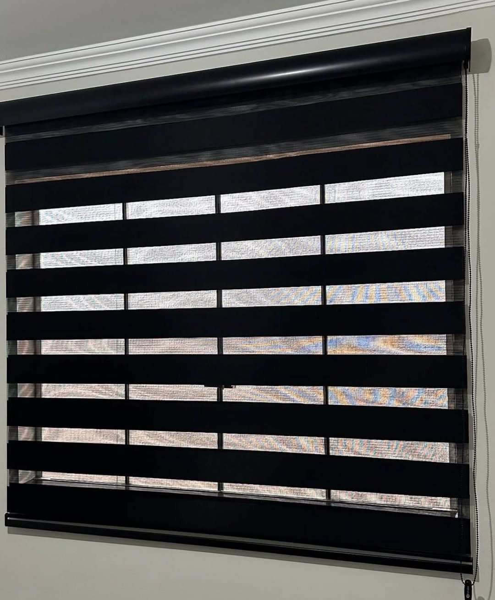
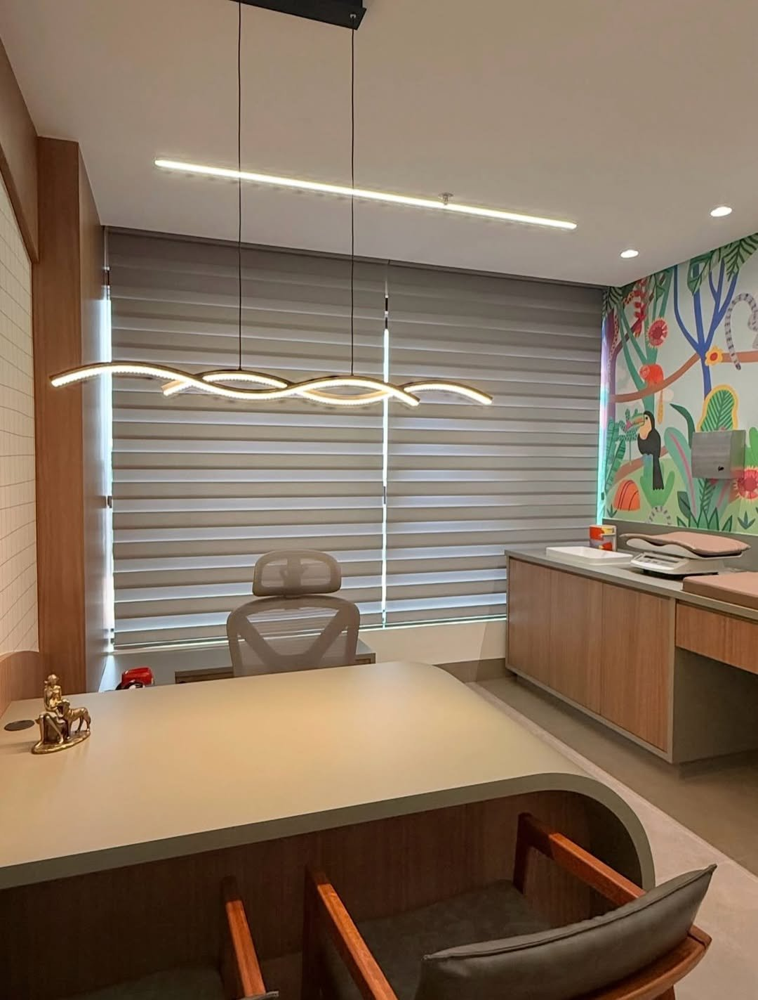

ستائر **الزيبرا**، أو **الليلي نهاري** كما يسميها كثيرون في الكويت، ستارة رول بطبقتين من القماش، فيهما شرائح شفافة وشرائح معتمة متناوبة. بحركة الحبل تتطابق الشرائح فيدخل ضوء النهار، أو تتعاكس فتُغلق النافذة للخصوصية، أو تُرفع الستارة كاملة. نفصّلها على مقاس نافذتك بسعر **9 د.ك للمتر المربع**.

## كيف تعمل؟

- **وضع النهار:** تتطابق الشرائح الشفافة، فيدخل ضوء ناعم مع حجب جزئي للرؤية.
- **وضع الستر:** تتطابق الشرائح المعتمة مع الشفافة، فتُحجب الرؤية ويقل الضوء.
- **رفع كامل:** تُلف الستارة إلى أعلى فتنكشف النافذة.

## الزيبرا أم الرول أم البلاك أوت؟

| النوع | التحكم بالضوء | العتمة | السعر |
|---|---|---|---|
| زيبرا (ليلي نهاري) | بدرجات، دون رفع الستارة | جزئية | 9 د.ك/م² |
| [رول](/curtains/roll/) | برفع الستارة وإنزالها | حسب القماش | 6 د.ك/م² |
| [رول بلاك أوت](/curtains/blackout/) | برفع الستارة وإنزالها | عالية | 6 د.ك/م² |

## أين تناسب؟

تناسب الأماكن التي تحتاج ضوءاً وخصوصية في الوقت نفسه، مثل غرف النوم والصالات و[المكاتب](/curtains/office/) والعيادات. ومن أعمالنا في العاصمة: [زيبرا سوداء لغرفة نوم](/projects/capital-zebra-black-bedroom/)، و[زيبرا رمادية لعيادة أطفال](/projects/capital-zebra-grey-clinic/) بستارتين متجاورتين يُضبط كل منهما وحده.

## السعر والتنفيذ

السعر 9 د.ك للمتر المربع (العرض × الارتفاع) شاملاً القماش والتفصيل. مثال: نافذة 2 × 1.5 م (3 م²) = 27 د.ك، ويُضاف 5 د.ك للتركيب إن كانت أقل من 5 ستائر. الزيارة وأخذ المقاسات وعرض العينات **مجانية** (عدا العبدلي والصبية)، والتنفيذ من يومين إلى 3 أيام حسب الكمية. باقي الأسعار في [صفحة الأسعار](/prices/).
