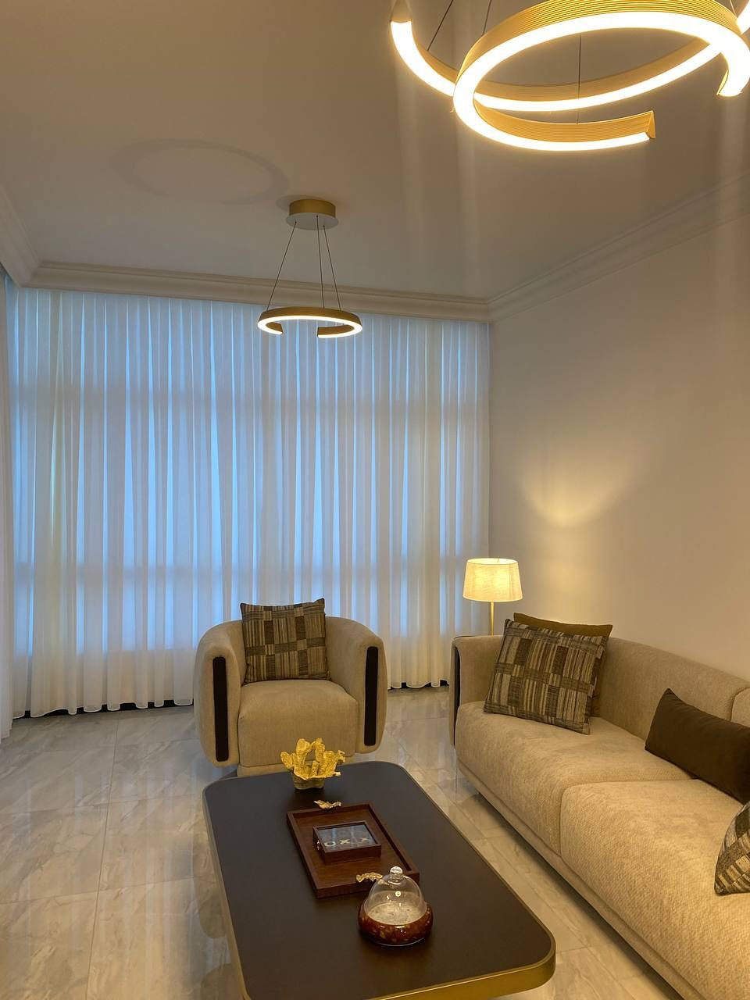

تركيب الستائر عندنا مجاني عند طلب 5 ستائر فأكثر، وأقل من ذلك 5 د.ك لكل ستارة، ونخدم جميع محافظات الكويت. اطلب عبر واتساب وسنحدد معك موعد القياس ثم موعد التركيب، ويستغرق التنفيذ من يومين إلى 3 أيام حسب الكمية.

## ماذا نركّب؟

- ستائر القماش على السكة، ومنها [ستائر الويفي](/curtains/wave/) و[ويفي مع شيفون](/wave-curtains/) و[ستائر الشيفون](/curtains/sheer/).
- [ستائر الرول](/curtains/roll/) و[البلاك أوت](/curtains/blackout/) و[ستائر الأطفال](/curtains/kids/).
- [الستائر الخشبية](/curtains/wooden/) (بليندات).

## كم يكلف التركيب؟

سعر المتر المربع يشمل القماش والسكة والتفصيل. والتركيب لكل الأنواع مجاني عند طلب 5 ستائر فأكثر، وأقل من ذلك يُضاف 5 د.ك لتركيب كل ستارة. جرّب [حاسبة الأسعار](/prices/) لتقدير المبلغ.

## كيف يتم التركيب؟

1. بعد [تفصيل الستائر](/services/tailoring/) على مقاس نافذتك نتفق معك على موعد التركيب.
2. نركّب السكة أو الرول في موقعك.
3. نعلّق الستارة ونجرّب حركتها معك قبل أن نغادر.

لتسهيل العمل، يفضّل إخلاء المساحة أمام النافذة قبل الموعد.

## مناطق التركيب

نركّب في المحافظات الست: العاصمة وحولي والفروانية ومبارك الكبير والأحمدي والجهراء، ولا نستثني منطقة. راجع [مناطق الخدمة](/areas/).

## أسئلة شائعة

**هل التركيب مجاني؟** نعم عند طلب 5 ستائر فأكثر، وهذا ينطبق على كل الأنواع. وأقل من ذلك يُضاف 5 د.ك لتركيب كل ستارة.

**هل أحتاج زيارة قبل التركيب؟** الزيارة المنزلية لأخذ المقاسات وعرض العينات مجانية. ويمكنك أيضاً إرسال صورة النافذة والمقاس التقريبي عبر واتساب لعرض مبدئي.

**ماذا لو ظهر عيب بعد التركيب؟** الضمان 3 أيام ويشمل التعديلات المطلوبة عند وجود عيب مصنعي، وبلا إرجاع. التفاصيل في [الضمان والاسترجاع](/warranty/).
