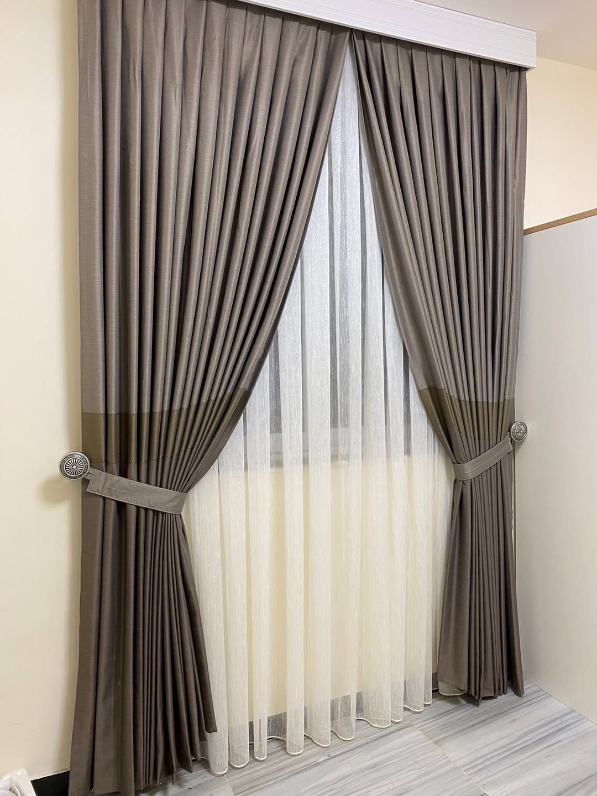

نفصّل الستائر على مقاس نافذتك: نأخذ المقاس في منزلك أو نكتفي بصورة النافذة والمقاس التقريبي عبر واتساب، ثم نرسل لك عرض سعر مبدئي. **زيارة أخذ المقاسات وعرض العينات مجانية**، والتنفيذ يستغرق من يومين إلى 3 أيام حسب الكمية.

نخدم جميع مناطق الكويت، ونفصّل جميع أنواع الستائر عدا الكهربائية.

## كيف تتم الخطوات

1. **القياس:** نزور منزلك لأخذ المقاسات وعرض العينات، أو ترسل لنا صورة النافذة ومقاسها التقريبي لنبدأ بعرض مبدئي.
2. **اختيار النوع والقماش:** تختار النوع واللون والقماش، ونحدد معك الطول المناسب للغرفة. أقمشتنا تركية.
3. **التفصيل:** تُفصَّل الستارة في ورشتنا في الضجيج على المقاس المتفق عليه.
4. **التركيب:** نركّب الستارة في موقعك، وتجد التفاصيل في صفحة [تركيب الستائر](/services/installation/).

## كم يكلف التفصيل؟

السعر بالمتر المربع (العرض × الارتفاع) ويشمل القماش والسكة والتفصيل: من 5 د.ك للشيفون، و6 د.ك للرول والويفي والبلاك أوت والأطفال والمكتبي، و7 د.ك للويفي مع الشيفون (الخام)، و9 د.ك للخام بلاك أوت مع شيفون، و17 د.ك للخشبي. والتركيب لكل الأنواع مجاني عند طلب 5 ستائر فأكثر، وأقل من ذلك يُضاف 5 د.ك لكل ستارة. يمكنك تقدير مبلغ نافذتك من [حاسبة الأسعار](/prices/). وللتفاصيل اقرأ [كيف تقيس نافذتك قبل طلب الستائر؟](/blog/how-to-measure-window/) و[كيف تحسب تكلفة تفصيل الستائر؟](/blog/curtain-cost-kuwait/).

## متى تختار المفصّل ومتى الجاهز؟

الجاهز يأتي بمقاسات ثابتة، وقد يترك فراغاً أو يزيد عن النافذة. أما المفصّل فيُصنع على مقاس نافذتك الفعلي. وإن كان الجاهز يناسبك فلدينا [ستائر رول جاهزة](/ready-roll-curtains/).

## الأنواع التي نفصّلها

- [ستائر رول](/curtains/roll/) للمكاتب والمطابخ وغرف المعيشة.
- [ستائر بلاك أوت](/curtains/blackout/) لغرف النوم.
- [ستائر ويفي](/curtains/wave/) و[ويفي مع شيفون](/wave-curtains/) للصالات والمجالس.
- [ستائر شيفون](/curtains/sheer/) و[ستائر أطفال](/curtains/kids/) و[ستائر خشبية](/curtains/wooden/).

## أسئلة شائعة

**هل يمكن طلب التفصيل بدون زيارة؟** نعم، أرسل صورة النافذة والمقاس التقريبي عبر واتساب لعرض مبدئي، ونحدد موعد القياس قبل التنفيذ.

**كم تستغرق مدة التنفيذ؟** من يومين إلى 3 أيام حسب الكمية.

**هل يوجد ضمان؟** نعم، ضمان يوم واحد يشمل إعادة إصلاح العيوب، وبلا إرجاع. التفاصيل في [الأسئلة الشائعة](/faq/).

**هل تخدمون منطقتي؟** نخدم جميع مناطق الكويت، راجع [مناطق الخدمة](/areas/).
